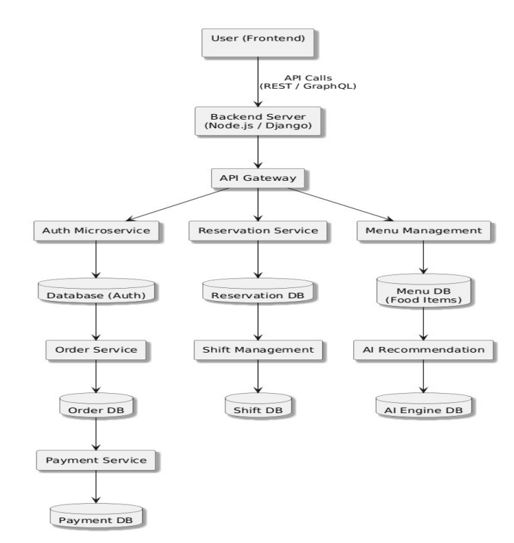
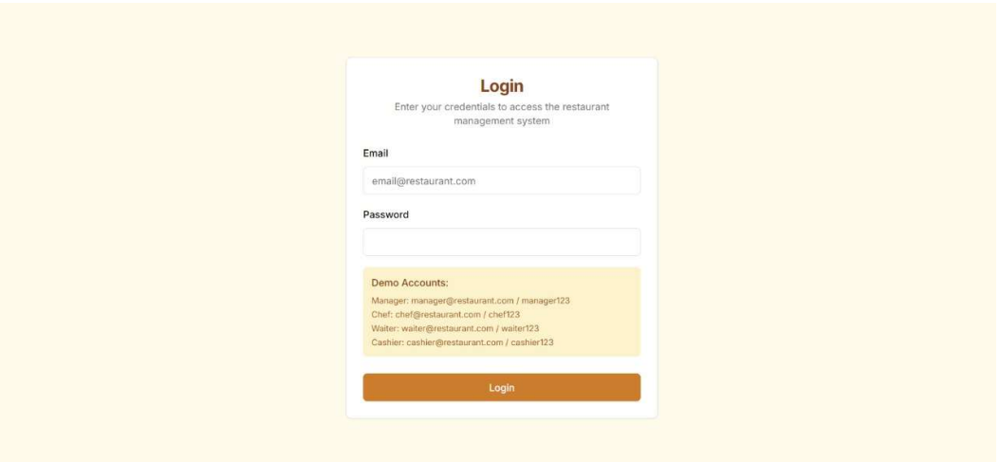
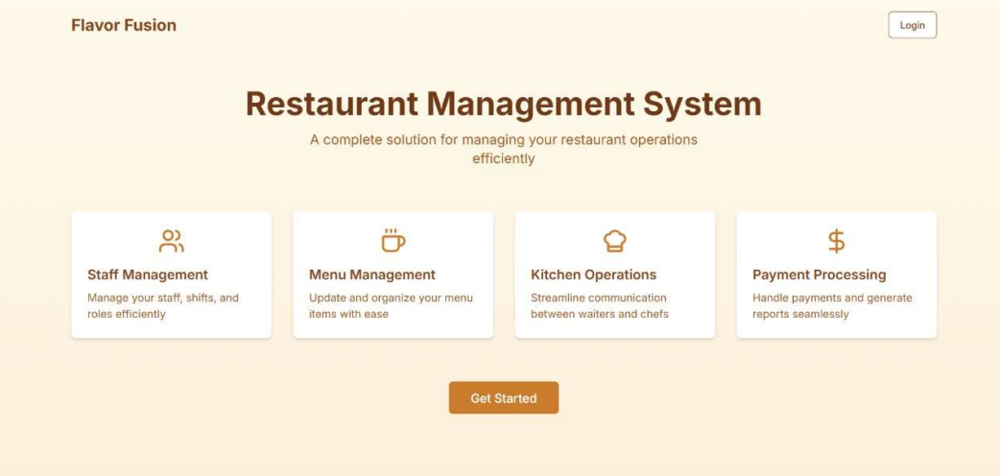

<h1 align="center">
🍽 Restaurant Management System
</h1>

<h3 align="center">

Role-Based Restaurant Operations Platform with Reservation, Orders, Staff & AI Recommendations

</h3>

Academic Full Stack Project • Microservices Architecture • MERN • AI Enhancement

---

# 🚀 Overview

Restaurant Management System is designed to digitize and automate restaurant operations including:

✔ Authentication & Role Access  
✔ Table Reservation  
✔ Menu Management  
✔ Order Tracking  
✔ Employee Shift Management  
✔ Payment Processing  
✔ Future AI Dish Recommendation System  

The system aims to reduce manual work, improve efficiency, and enhance customer experience.

---

# 🎯 Problem Statement

Traditional restaurant workflows rely heavily on manual operations:

- Reservation handling
- Order processing
- Shift scheduling
- Menu updates
- Payment management

This increases:

❌ Delays  
❌ Human errors  
❌ Operational inefficiency  

This project solves these using a centralized digital platform.

---

# 🛠 Tech Stack

### Frontend

React.js

### Backend

Node.js  
Express.js

### Database

MongoDB

### Authentication

JWT  
bcrypt

### Future AI Module

Python  
FastAPI / Flask

### Deployment (Planned)

Vercel / AWS / Heroku

---

# 👥 User Roles

The system provides dashboards for:

👑 Owner/Admin

- Register users
- Assign roles
- Menu management
- Staff management

🧑‍💼 Receptionist

- Table reservations
- Booking updates

🧑‍🍳 Chef

- Kitchen queue
- Order status updates

🧾 Waiter

- Orders
- Table handling

Manager

- Staff shifts
- Reports

(Role-based workflows from project design.) :contentReference[oaicite:2]{index=2}

---

# ✨ Core Features

### 🔐 Authentication

Owner-controlled registration

Role-based login

Secure access

Session timeout

---

### 🍽 Table Reservation

Reserve tables

View availability

Manage bookings

---

### 📋 Order Management

Real-time order handling

Kitchen notifications

Status updates

---

### 🥘 Menu Management

CRUD operations

Real-time updates

---

### 👨‍🍳 Employee Shift Scheduling

Assign shifts

Track conflicts

Notifications

---

### 💳 Payment Handling

UPI

Cards

Wallets

---

### 🤖 AI Recommendation (Future Scope)

Suggest best-selling dishes

Analyze customer behaviour

Recommendation engine

---

# 🏗 Architecture

This project follows:

Microservices Architecture

API Gateway

Separate services:

Authentication

Reservation

Menu

Orders

Payments

Shift Management

AI Recommendation

Architecture diagram from report:

---

# 🖥 Screenshots

## Login Page

---

## Landing Dashboard

---

# 📊 Functional Highlights

✔ Role-Based Access Control

✔ Reservation System

✔ Menu CRUD

✔ Employee Scheduling

✔ Order Tracking

✔ Payment Processing

✔ Future AI Recommendations

---

# 📈 Project Outcomes

This project improves:

✔ Operational Efficiency

✔ Staff Coordination

✔ Customer Experience

✔ Restaurant Workflow Automation

✔ Scalability

✔ Security

Based on report conclusions. :contentReference[oaicite:3]{index=3}

---

# 🔮 Future Enhancements

Planned:

- Mobile App
- AI Dish Recommendation
- Inventory Management
- Waste Tracking
- Customer Reviews

:contentReference[oaicite:4]{index=4}

---

# 👨‍💻 Team

Mugash Priyan U

S Kishor

Prasanth B

Guided by:

Dr. B Prabhu Kavin

SRM Institute of Science & Technology

---

# 📌 Status

✅ Completed Academic Project

Prototype + Architecture + Design Documentation

---

⭐ If you found this project interesting, consider giving a star.
